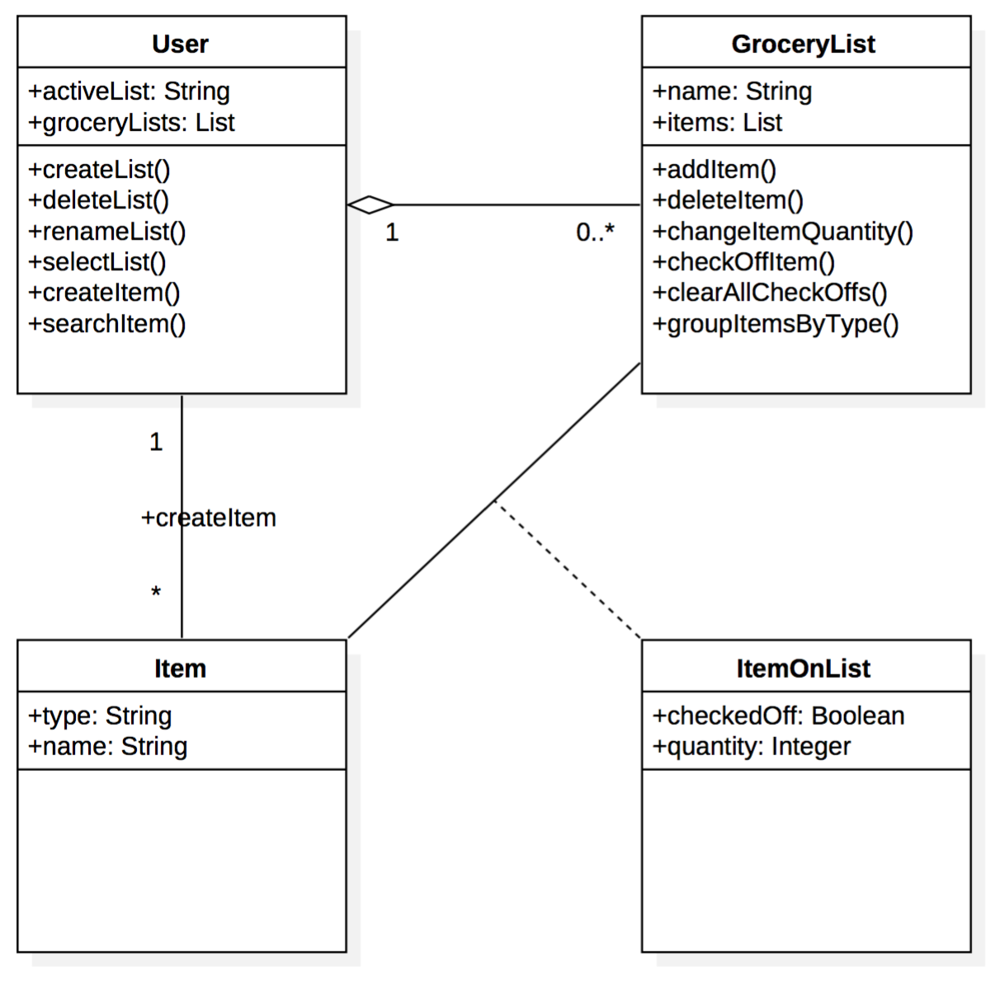

# Deliverable #1

## Individual Designs
### Design 1

**Pros**: Straightforward. Nice and simple design. User can interact with both the **Item** class and **GroceryList** class. 

**Cons**: We are unsure about the database left out of the UML representation.

### Design 2

**Pros**:
Relationships are properly marked, i.e., one-to-many.

**Cons**:
Item name and quantity are missing.
Hierarchical list operations and attributes could be implemented on other classes.
Operations **crossOff** and **crossOffItem** are duplicated.

### Design 3

**Pros**:
Clean design

**Cons**:
Incorrect relationship between **User** and **GroceryList** classes.
Extraneous attributes and operations on the **User** class.
**GroceryList** class appears to take the role of **GroceryListManager** and the actual **GroceryList** is missing.

### Design 4

**Pros**:
It has an **activeList** attribute.
Good hierarchy of **GroceryList** -> **ItemType** -> **Item**.

**Cons**:
Unsure about **GroceryList** class only having **ItemTypes** and no **Items**.
To better express its function, **clearCheckedOff** could have been named **toggleCheck**.
Unsure about use of aggregation instead of association between the different classes.

## Team Design

### Similarities
All diagrams were similar in the sense that there was a **User** or **GroceryListManager** as the main class and then a **GroceryList** class for managing the list.
The relationships were also almost the same across the uml designs.

### Differences
The chosen design did not have a database represented in the uml diagram. Also, the design had an **ItemOnList** separate from the **Item** class. 
Unlike other designs, the chosen design has a cyclical relationship allowing the **User** to add an **Item** to a **GroceryList** while also allowing the **User** to directly add an **Item** without adding it to the **GroceryList**.

### Justifications
The design uses a one (zero) to many (0..\*) relationship between **User** and **GroceryList**. This is because the requirements specify that the **User** can have zero or multiple grocery lists. This design also has a many to many relationship between **GroceryList** and **Item** via the association class **ItemOnList**. This is because a **GroceryList** can have many items and an **Item** can be in multiple grocery lists.

The design left the database out on purpose since the database would not be relevant in terms of uml design. The design assumes standard database operation, where each operation that modifies data runs in a transaction, therefore saving immediately.
List and item changes are persisted automatically and immediately.

In order to store **Item** attributes such as **checkedOff** and **quantity**, the design uses an association class called **ItemOnList**. This is to allow this information to be stored separate from the main **Item** class. Without this association class it would be difficult to persist the item attributes specific to one **GroceryList**. 

The arguments for the operations are left out on purpose, therefore operations such as **searchItem** from the **User** class is capable of searching the **Item** by either name, type or both.

## Summary
We started expecting very different designs and opinions, however there were many similarities across the designs. One of the designs had a very unique approach by modeling the diagram from a UI perspective and it was interesting having the design explained.

The team worked well, with everyone contributing, commenting and asking questions. One lesson learned is that there is a lot of ambiguity when creating the design from the requirements. There is a lot of the design that is left up to interpretation. This can make it difficult to create one design that makes perfect sense to everyone.

Working together as a team showed how each team member processed the design requirements in different manners. It’s refreshing and enlightening to listen to each team member defend their design because each person’s contributions is based off of valuable experience.
