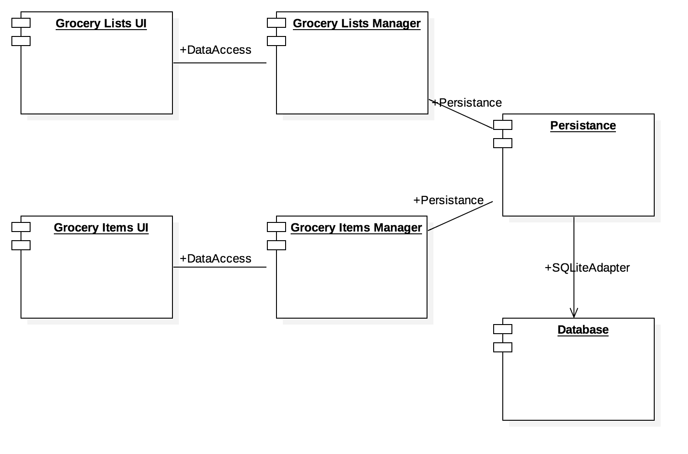
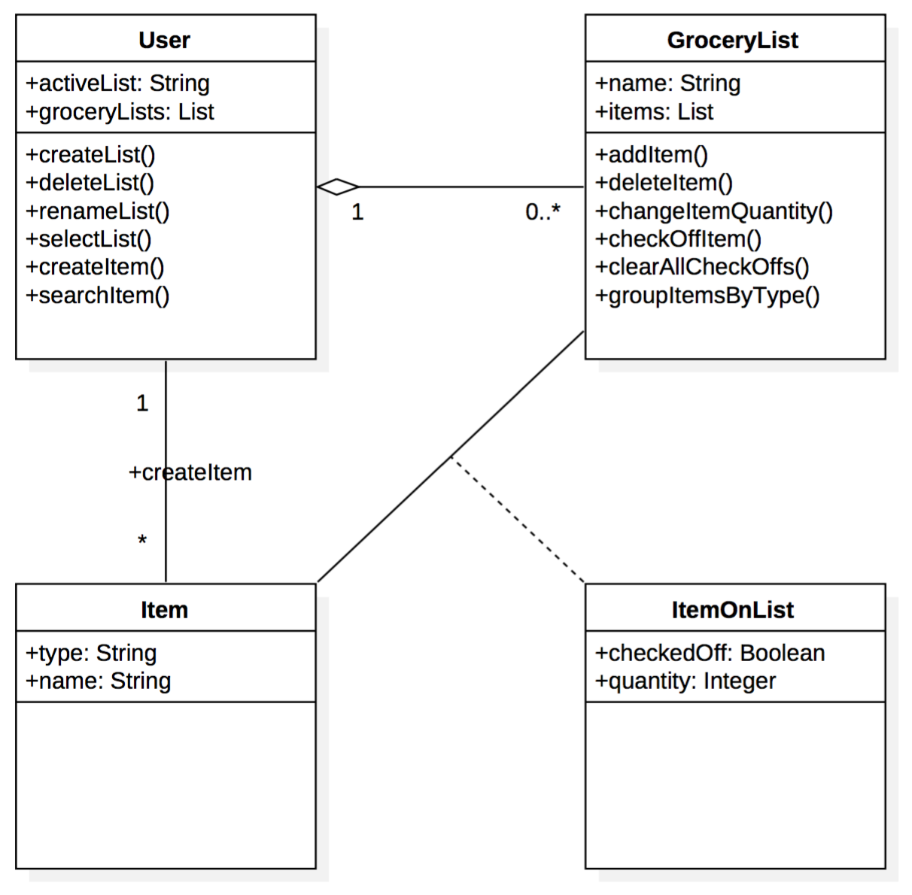
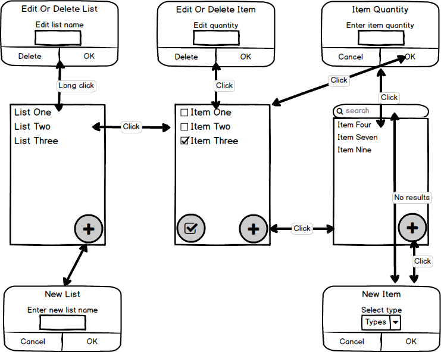

# Design Document

**Author**: btecu3 @ team87

## 1 Design Considerations
### 1.1 Assumptions
 - Since no user management is specified in the requirements, the application will run as a mono environment.
 - The data is stored only on the device.
 - The database is relational and it uses SQLite, which is supported by Android.

### 1.2 Constraints
 - Cannot access the Network (Internet), hence the entire database of items with their own types is stored on the device
 - Storage is a constraints and there should be special consideration in building the list of items to be compact.

### 1.3 System Environment
There is no minimal hardware requirements as long as the device is either a phone or a table and it runs a supported Android version. Supported Android versions are KitKat (4.4 | API 19) or newer.

## 2 Architectural Design
### 2.1 Component Diagram

The component diagram is rather simple. There are two main user interface component, **GroceryListsUI** (display list of grocery lists) and **GroceryItemsUI** (display items of a grocery list). Each of the UI components use a manager component (**GroceryListsManager** and **GroceryItemsManager**) which does mostly the work of validating and filtering the input. Finally, both manager components use a **Persistance** component, which translates between specific classes to data in the database, be it for retrievel or storage, using the **Database** component. 

### 2.2 Deployment Diagram
The application runs sandboxed and it does not require any special permissions since the database is included with the application. Therefore, the deployment diagram unecessary because is too simplistic.

## 3 Low-Level Design
### 3.1 Class Diagram

## 4 User Interface Design

