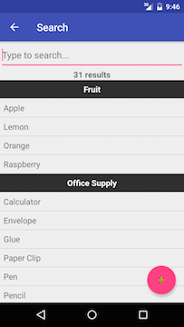

# Grocery List Manager – User Manual

## Introduction
Grocery List Manager is an application that helps users to
manage their grocery lists. It has various functionalities to customize and edit the grocery lists. It is built for Android and can run on any device with Android 4.4 or newer.

## Main Menu
The first screen when opening the application is the main menu. It displays a user's list of grocery lists. Users can create, delete, rename and open their desired grocery list.  

### Create List
To create a list, the user can press on the red **+** button located at the bottom right of the screen.  
A dialog will ask for the name of the new grocery list. The user can enter a grocery list name and press **OK**. The user has the option to cancel the operation.  

### Rename & Delete List
To rename or delete a grocery list, the user can (long) press and hold the grocery list to be edited.
A dialog will ask for a new name and the user can edit current name and press **Rename**. Alternatively, the user can press **Delete** to delete the grocery list. As always, the user has the option to cancel the operation.  

### Select List
To view a list, the user can press on the grocery list name, which will transition to a different screen.

## Grocery List
After selecting a grocery list, the use will see either an empty list or a list of items, if the the list is not new.
When the grocery list has items, they will be displayed grouped by their type in alphabetical order, both by type and by name.  

### Add Item
To add add a new item to the list, the user can press on the red **+** button located at the bottom right of the screen.  
The application will transition to a new screen with the available grocery items in a sorted hierarchical list (grouped by type and name).  

The user can use the top search functionality to further filter the list and quickly find the required item. The search is intelligent to look both for type and name, however, it will not display empty types.  

To add a specific grocery item to the grocery list, the user can simply press on the item name. If the grocery list already contains the grocery item, it will display a notification indicating so. Otherwise, a dialog will prompt the user to enter the quantity desired.  

Once the user presses **Change Quantity**, the application will return to the grocery list screen.

### Create Item
After searching for a specific item, if there are no matches, the user can create a new item.  
To create a grocery item, the user can press on the red **+** button located at the bottom right of the screen.  

A dialog will ask for the type and a new name.  

The user can select a type from the existing list of types.  

To confirm the operation, the user can press **Add New Item**. As always, the user has the option to cancel the operation.  

### Change Quantity & Delete Item
To change quantity or delete a grocery item, the user can press the grocery item to be edited.
A dialog will ask for a new quantity and the user can edit current quantity and press **Change Quantity**. Alternatively, the user can press **Delete** to delete the grocery item from the list. As always, the user has the option to cancel the operation.  

### Check Off Item
To check off a grocery item, the user can press the checkbox on the left side of the item name.  

### Clear All Check Offs
The user can clear all checked off grocery items by pressing on the red checkbox button located at the bottom left of the screen.  

**Bonus**: If no grocery item is checked off, the check off all button will check off all grocery items.